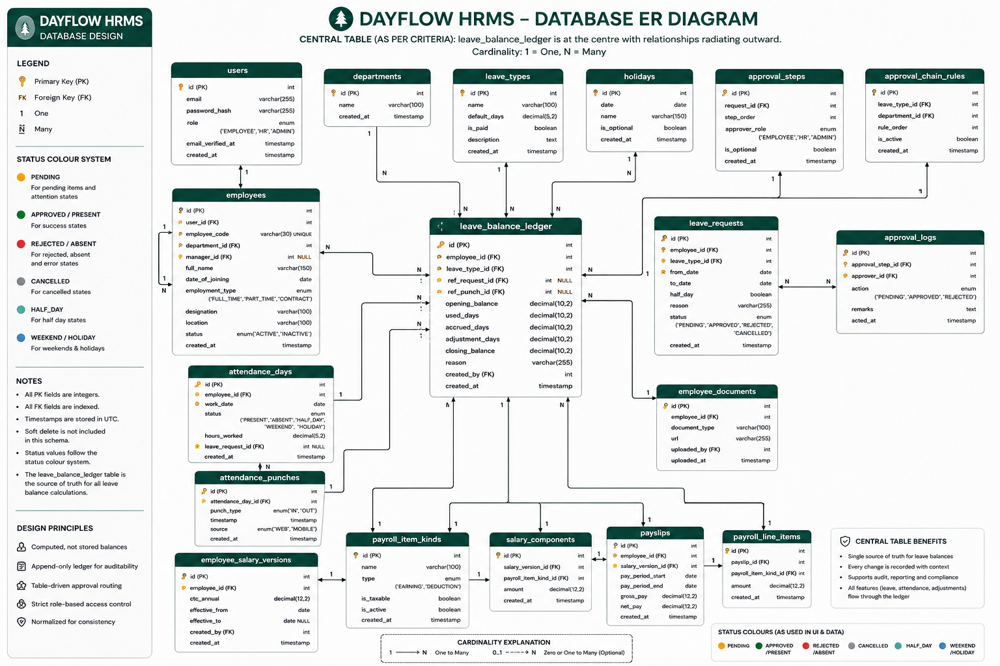

# dayflow-hrms

> Every workday, perfectly aligned.

Dayflow is a Human Resource Management System designed to streamline employee management, attendance tracking, leave management, payroll visibility, and approval workflows for employees and HR/Admin users.

## Screenshots

<!-- Add 3 screenshots here:
1. Dashboard
2. Leave balance ledger
3. Approval queue
-->

## Setup

<!-- Add the 4 tested setup commands here. -->

## Demo Accounts

| Role | Email | Password |
|---|---|---|
| Admin | admin@dayflow.io | Dayflow@2026 |
| HR | hr@dayflow.io | Dayflow@2026 |
| Employee | priya@dayflow.io | Dayflow@2026 |
| Employee | arjun@dayflow.io | Dayflow@2026 |

## Schema Diagram

The Dayflow HRMS database is centred around the `leave_balance_ledger`, which provides an auditable record of leave balance changes.

## Design Decisions

### Why balances are computed, not stored

Leave balances are represented through the `leave_balance_ledger` so that balance changes remain auditable and reversals can be recorded without deleting historical information.

### Why approval routing lives in a table

Approval routing is represented as database records so that approval policies can be changed through data rather than requiring application deployments.

### Why punches are append-only

Attendance punches preserve the original source events so attendance can be recomputed from the underlying records.

### Why email verification is stubbed

The token flow is implemented while SMTP is deliberately omitted to avoid introducing a third-party dependency.

## Performance

<!-- Add the two EXPLAIN ANALYZE outputs here:
- Before indexing
- After indexing
-->

## Team

<!-- Add team members, responsibilities and branch names here. -->

## SRS Traceability

<!-- Add the SRS traceability table from CLAUDE.md §14 here. -->
